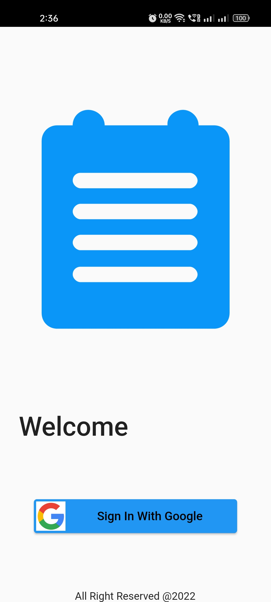
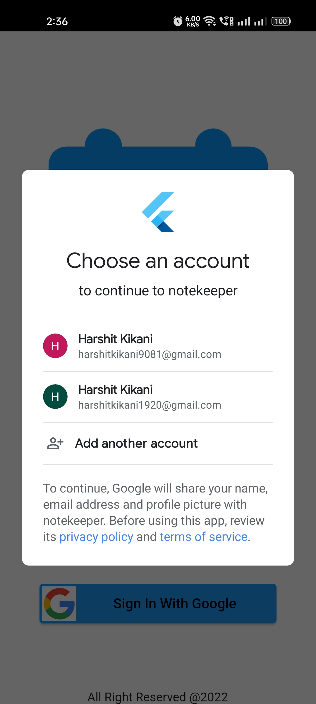
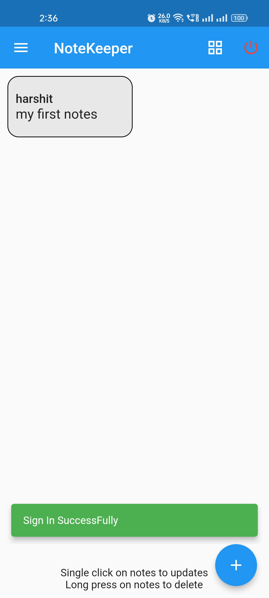
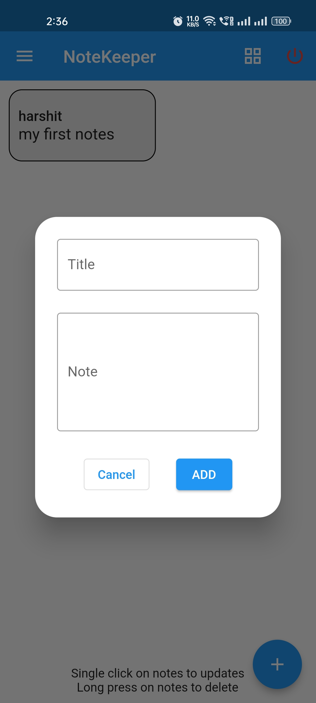
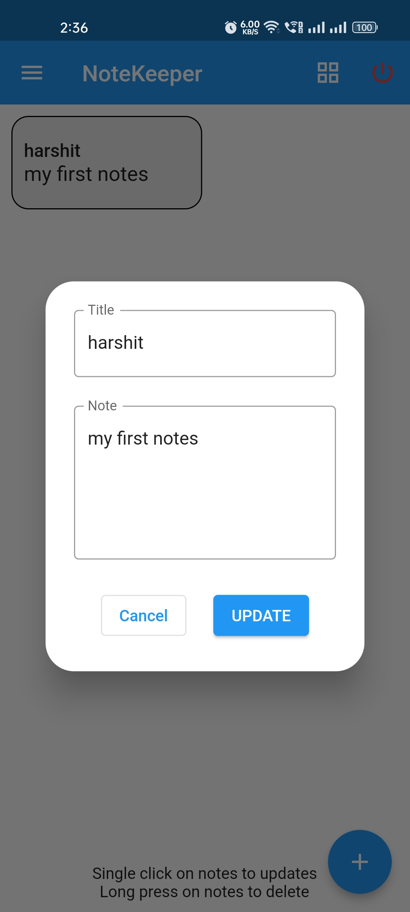
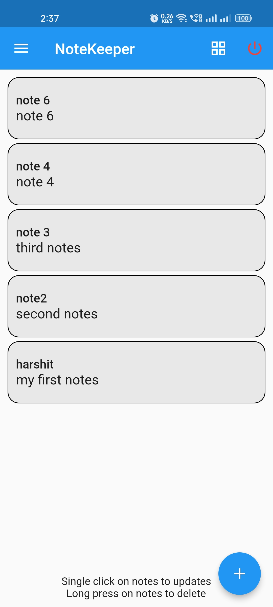
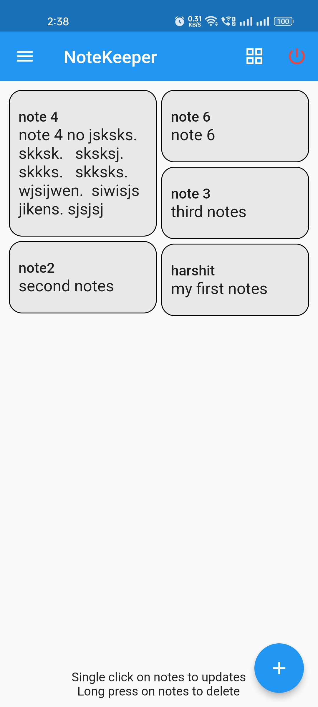

# notekeeper App

## Cloud Firestore | Firebase

### Features

<ul>
<li>Add, Update and Delete Notes</li>
<li>Share Notes</li>
<li>Copy note in Clipboard</li>
</ul>

## App UI Screenshots

                             

                             

                             

 
